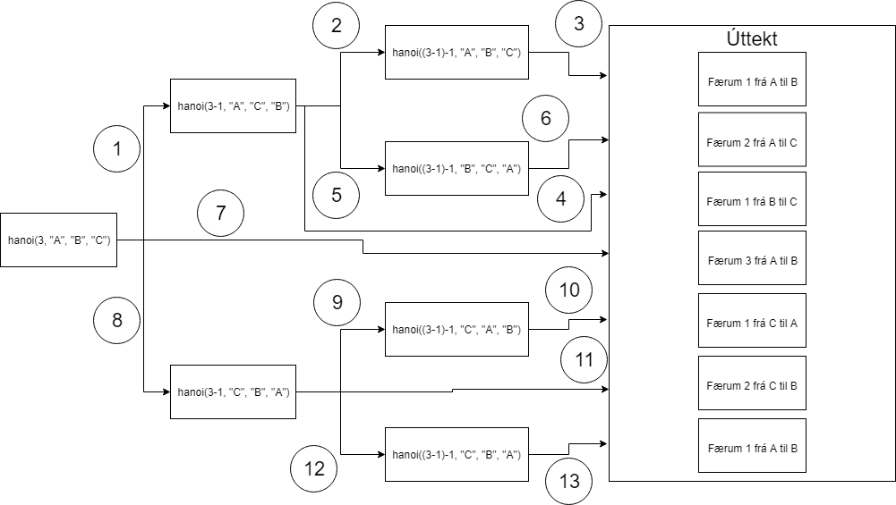

# Skilaverkefni 3 í reikniritum

### 1. 




### 2. (1/15) Hver er flækjutími fallsins hanoi(n,A,B,C) í liðnum hér fyrir ofan? Rökstyddu svarið.
```
Flækjutími fallsins hanoi(n,A,B,C) er O(2^n). O(2 ^ N) táknar algrím þar sem vöxturinn tvöfaldast við hverja viðbót í gagnasettið. Formúlan fyrir minnstu skref sem hægt er að leysa hanoi í er 2^n -1. Því er flækjutími fallsins O(2^n)

```

 ### 3. (3/15) Útskýrðu stuttlega tímaflækjurnar hér fyrir neðan. Nefndu dæmi um reiknirit sem hafa eftirfarandi tímaflækjur. 
  * a. O(n) 
  * b. O(n^2 ) 
  * c. O(log(n))
 ```
 
O(N) lýsir algrími þar sem árangurinn mun vaxa línulega í beinu hlutfalli við stærð gagnasettsins.
Dæmi: forrit sem skannar array tekur O(n) mikinn tíma. 


O(N²) táknar algrím þar sem árangurinn er í réttu hlutfalli við rótina af stærð gagnasettsins.
Dæmi um o(n^2) er bubble sort.

O(log N) lýsir algrími þar sem gagnasafnið er skipt jafnt í marga hluta eins og ættartré. Ef  það tekur 1 sekúntu að reikna 10 atriði þá mun það taka 2 sekúntur að reikna 100 atriði. 
Dæmi um O(log n) er binary search.

```

### 4. (3/15) Útfærðu fall sem býr til alla mögulega strengi af lengd n úr lágstöfum enska stafrófsins 
## [KÓÐI](https://github.com/larussverris/reiknirit-larus/blob/master/skil3/main.py)
